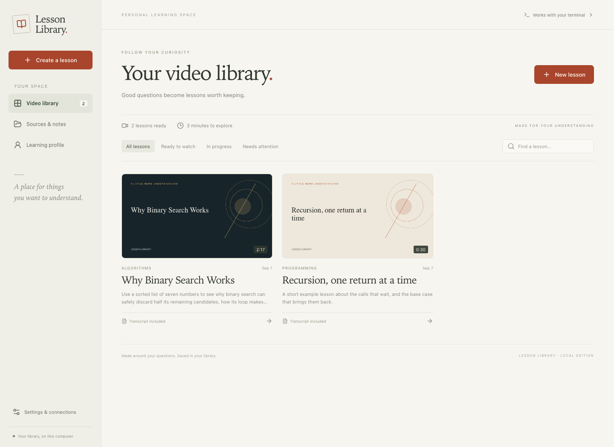

# Lesson Library

A personal video learning app, shaped around what you know and where you get stuck. Create a lesson in the app or from a Codex / Claude conversation, then find it in the same local library.



## What works

- A desktop or browser app with a searchable video catalog, thumbnails, progress, and lesson-specific visuals.
- Narrated MP4 lessons, timestamped transcripts, captions, chapter navigation, and a comprehension question.
- A tutor beside each video, with saved conversations and clickable timestamp references.
- A Markdown learner profile, automatically discovered Obsidian vaults, and ChatGPT / Claude / Gemini conversation or memory imports.
- Codex and Claude Code providers using your installed, signed-in CLIs. No separate model API key required by the app.
- Local neural narration with Kokoro, six voice choices, speed control, and an audio preview. System speech and Piper remain available.
- A shared CLI and companion skills so an agent can add lessons using the context of your current conversation.

Lessons can combine diagrams, typeset equations, plots, code walkthroughs, processes, concepts, and comparisons. Auto chooses representations scene by scene; optional presentation preferences and visual directions guide the result. Colors are configured separately. It does not generate cinematic footage, upload to YouTube, or silently synchronize account memory.

## Run from GitHub

macOS is the tested platform. Install **Node.js 22.16 or newer**, **FFmpeg** (including FFprobe), and either [Codex](https://github.com/openai/codex) or [Claude Code](https://code.claude.com/docs/en/overview). Sign into your chosen agent once using its normal CLI.

```sh
git clone https://github.com/michael-L-i/gen-learning-vids.git
cd gen-learning-vids
nvm install                    # if you use nvm; reads .nvmrc
npm ci
npm run build
npm link                       # makes learnvid available in your terminal
learnvid doctor
npm start                      # opens the local browser app
```

On a Mac with Homebrew, `brew install ffmpeg` installs the media tools. Kokoro downloads its model on first use; macOS system speech is also available. Open **Settings & connections** to choose Codex or Claude, check installed tools, or change narration.

To open a desktop window instead:

```sh
npm run desktop
```

The desktop window and terminal use the same library. Keep the checkout in place after linking the CLI or skills. No personal library files need to live in the repository.

## Make your first lesson

1. In **Learning profile**, describe your background, goals, uncertainties, and useful explanation preferences.
2. In **Sources & notes → Add a source**, use **Upload file** or **Upload folder**, paste text, choose a detected Obsidian vault, or open **Conversations & memory** and select ChatGPT, Claude, or Gemini. [Import instructions and supported formats](docs/source-imports.md).
3. Select **Create a lesson**, give it a question, describe where you are stuck, and select relevant sources. Leave Presentation on Auto or choose an approach and add visual directions.
4. Open the finished video to watch, jump through its transcript, reveal the comprehension check, or ask questions.

The profile is included automatically. Notes are included only when selected for that lesson. A note's presence is not treated as proof of understanding. Each lesson retains its original context snapshot even if you later edit your profile or remove a source.

You can test speech and rendering without contacting a model provider:

```sh
learnvid create "Recursion, one return at a time" --plan examples/recursion.json --wait
```

## Use from Codex or Claude

Install the companion skill for either or both agents:

```sh
npm run skill:codex
npm run skill:claude
```

These commands link the repo's skill into `~/.agents/skills/lesson-library` or `~/.claude/skills/lesson-library`. Existing skills are never overwritten. Start a new agent session after installation. To uninstall, remove the corresponding symlink; your videos remain intact.

Ask the agent: **“Make a Lesson Library video about what we just discussed, focusing on the part I was confused about.”** The skill can write the lesson plan itself and pass a concise learner-context brief to the renderer. This carries the current conversation into the app without starting another planning conversation.

The [plugin directory](plugins/lesson-library) also includes Codex and Claude manifests. Claude Code can load it directly with `claude --plugin-dir ./plugins/lesson-library`. The skill installation above is the simplest local Codex setup; no marketplace is required.

You can also use the CLI directly:

```sh
learnvid create "Why binary search works" --goal "I understand loops, but not why halving is safe"
learnvid create "Recursion" --source ~/Notes/recursion.md --brief /tmp/learning-context.md
learnvid list
learnvid show LESSON_ID
learnvid ask LESSON_ID "Can you trace one smaller example?"
learnvid retry LESSON_ID
learnvid open
```

Creation runs in the background. Add `--wait` to wait for the final result. `--source` accepts a file and can be repeated. An agent-authored JSON plan can be supplied with `--plan`; see the [lesson format](plugins/lesson-library/skills/lesson-library/references/lesson-format.md).

## Memory and Obsidian

This app does **not** have automatic access to ChatGPT saved memory, all your chats, or Claude account history. There are three explicit ways to bring context in:

- **Current conversation:** the companion skill uses the context available to the calling agent, then saves a brief with the lesson.
- **Conversations & memory:** choose ChatGPT, Claude, or Gemini, then upload an extracted export file or paste a conversation or memory summary. Preview and edit the extracted text before saving. ChatGPT imports follow the active conversation branch and omit system messages. Gemini imports support activity JSON and HTML; they preserve available exchanges without inventing conversation grouping. ZIP archives must be extracted first. These are local copies, not account connections.
- **Obsidian:** select a vault discovered from Obsidian’s local registry, preview its Markdown/text notes, and import selected copies. A single discovered vault is previewed automatically; manual path entry is available if discovery fails. No MCP server is needed for this local import. Hidden folders and symlinks are skipped. Originals are not edited, and subsequent note changes are not automatically synced.

Imports are reference material. They do not automatically rewrite the learner profile or establish mastery. The app currently uses explicit selection and bounded excerpts, rather than a vector database or background vault indexing. The lesson's **Sources & context** tab shows exactly which excerpts were used, including truncation.

## Your library folder

By default everything is under `~/Lesson Library`:

```text
Lesson Library/
  profile/learner.md
  settings.json
  sources/<id>.json
  videos/<lesson-id>.mp4
  lessons/<lesson-id>/
    lesson.json
    storyboard.json
    context.json
    thumbnail.png
    transcript.md
    captions.vtt
    chat.json
  .models/kokoro/               cached neural speech model
  .previews/                    cached voice previews
  .jobs/                       temporary agent workspaces
```

Use `LEARNVID_HOME=/absolute/path` or `--library /absolute/path` to choose a different folder. All clients must point at that same location. Back it up as an ordinary folder. Individual files are written atomically and lesson locks prevent competing writers. Failed or interrupted jobs can reuse their saved plan on retry.

The server listens on loopback only. Browser writes require a per-instance token and same-origin requests. This is a single-user app; it is not designed for exposing a server to the internet. Locally stored notes are private from the public repository, but **selected excerpts, learner context, and questions are sent to the configured Codex/Claude model provider**. Local orchestration is not offline inference.

## Speech and output

- **Default for new libraries: Kokoro.** The app bundles the speech runtime and six US/British English voice choices. First use downloads approximately 100 MB of model files to `~/Lesson Library/.models/kokoro`; subsequent generation works offline. No speech API key or Python environment is needed. Choose a voice and speed in Settings, then select **Preview voice**. Preview uses the current form values without saving them.
- **System speech:** macOS `say`, with a voice name and speaking pace in Settings. List voices using `say -v '?'`. On Linux the system adapter expects `espeak`.
- **Piper:** install the `piper` executable and a compatible `.onnx` voice model plus its configuration, then select its absolute model path in Settings. This adapter is implemented but has not yet been tested on a machine with Piper installed.
- **Output:** 1280×720 H.264 / AAC MP4, approximately timed WebVTT captions, and a Markdown transcript. Chapter boundaries use measured speech durations; captions divide words across those durations, so they are not word-aligned transcription.

Existing libraries retain their explicitly saved speech engine; choose Kokoro and save Settings to switch. Existing videos keep their original audio. New libraries default to Kokoro’s Heart voice at 1× speed.

The first version is oriented to English lessons. Linux system speech and Windows desktop packaging are not yet validated.

## Development and packaging

```sh
npm run dev                    # local API + Vite
npm run check                  # storage/API tests + production build
npx playwright install chromium
npm run test:ui                # browser flows, no model credentials required
npm run desktop:package        # local .app in release/ on macOS
npm run dist:mac               # build a DMG
```

Use a supported Node version for Electron packaging. The artwork source is `build/icon.svg`; `npm run build:icon` regenerates PNG/ICNS assets on macOS. Developer builds are not notarized automatically. Signing and notarization for wider distribution require the distributor's Apple configuration.

Real Codex lesson generation, Claude lesson generation, Claude transcript Q&A, macOS speech, MP4 playback, seeking, and narrow-screen layouts were exercised during implementation. CI covers storage, imports, context snapshots, retries, writer locking, local API access controls, and browser flows without contacting a model provider.

See [architecture and next steps](docs/architecture.md) for extension points. MIT licensed.

## Adaptive presentation

Presentation preferences are **Auto**, **Worked example**, **Visual explanation**, **Code walkthrough**, and **Slides**. They guide the agent's choices rather than lock every chapter into one template. Physics can combine a force diagram, algebra, and a graph; biology can use structures and labeled processes; coding can show actual code, highlighted lines, and traced output.

Equations use MathJax SVG, diagrams use positioned nodes and directional links, and plots use explicit coordinate data. Progressive equation steps, diagram nodes, process steps, and code highlights are evenly spaced across chapter audio. Reveals are not word-aligned. Code walkthrough content is displayed without execution. These structured formats remain compatible with existing lesson JSON; continuous animation and optional authored scientific scenes are described below.

```sh
learnvid create "Projectile motion" --presentation auto --visual-brief "Use a diagram, then derive the equations and compare trajectories"
learnvid create "Motion" --plan examples/motion.json --style auto --wait
```

The [visual schema](plugins/lesson-library/skills/lesson-library/references/visuals.md) documents the agent-authored content formats. Finished thumbnails come from the lesson's first visual.

Kokoro uses the [official Kokoro.js implementation](https://github.com/hexgrad/kokoro/tree/main/kokoro.js) and the [ONNX model distribution](https://huggingface.co/onnx-community/Kokoro-82M-v1.0-ONNX). The model and speech library have Apache 2.0 licenses; dependency licenses remain with their respective packages. The app uses quantized CPU inference and splits long narration into bounded chunks to avoid tokenizer truncation. Narration text is not sent to a speech service.

```sh
learnvid voices
learnvid speech-preview --output /tmp/voice-preview.wav
```

## Animation modules

The agent chooses and composes capabilities for the lesson; the engine renders them with shared narration and library storage.

- [Continuous SVG animation](docs/animation-engine.md): grouped shapes, measured text and narration-relative motion.
- [Geographic globes](docs/geography-animation.md): bundled country boundaries, smooth camera rotation/zoom, individual country highlights and markers. This works in ordinary animation plans and is included in the UI planner's capability guidance.
- [Online image assets](docs/image-assets.md): discover images through the agent/CLI, retain attribution, and mix local raster assets with animation.
- [Blender 3D rendering](docs/blender-rendering.md): optional trusted-local scenes with materials, lighting and camera control, plus explicit reuse of identical frames.
- [Scientific animation](docs/scientific-animation.md): optional Matplotlib, NumPy and SymPy scenes through an explicit trusted-local Python command.

Plans can retain cited `sources` (title and URL) in the downloadable transcript. Caption chunks are estimated from narration intervals, not forced word alignments. Generated lessons and personal benchmark artifacts remain outside the repository.

### Browser animation

The coding agent can choose detailed 2D animation, Three.js spatial scenes and RDKit.js chemical diagrams through the [browser capability](docs/browser-animation.md). Libraries install with npm; Chromium downloads on first use. Blender remains an explicitly enabled, separately installed option. These authored routes share the app library, transcript and Q&A. The ordinary UI planner does not author JavaScript scenes yet.
