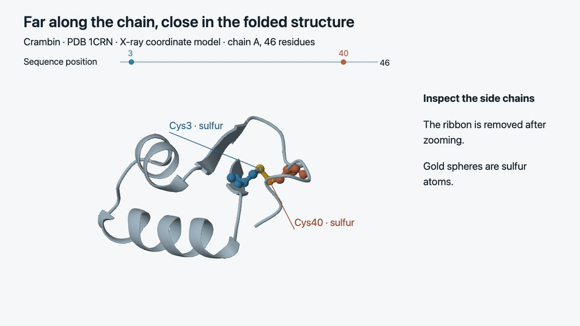

# Lesson Library

An open-source engine for AI-assisted educational videos and scientific animation. Create narrated lessons with diagrams, equations, simulations, and source material. Codex or Claude can author scenes from your conversation; the app keeps videos, transcripts, and follow-up questions in a local library.



From the whole protein to a disulfide bond: a 10-second excerpt rendered with Mol\*. Structure: [PDB 1CRN](https://www.rcsb.org/structure/1CRN). [Clip details and attribution](docs/assets/README.md).

[Get started](#get-started) · [Render an example](examples/first-scene/README.md) · [Contribute](CONTRIBUTING.md) · [Architecture](docs/architecture.md)

## What it does

- Produces 1280×720 narrated MP4s, captions, timestamped transcripts, chapters, and a comprehension question.
- Connects animation to measured narration beats, with processing pauses and persistent labels.
- Uses your question, learner profile, conversation brief, and selected sources to guide the explanation. Notes and watched videos do not establish mastery.
- Saves lessons, original context, and per-video tutor conversations in a shared local library used by the browser app, desktop shell, and CLI.

There are two authoring paths:

| Entry point | How a lesson is made |
|---|---|
| **App: Create a lesson** | The configured Codex or Claude CLI drafts and revises structured lesson data. Supports equations, diagrams, plots, code displays, and structured SVG animation. |
| **Coding agent + companion skill** | The agent discovers capabilities, reads the relevant guides, and writes scene code. This path supports the richer browser modules shown below, including the protein demo. |

Both paths publish to the same library. The app's planner does **not yet author executable browser scenes**. Blender and Python scientific rendering are optional, separately installed capabilities. Final videos are recordings, not interactive simulations.

## Get started

macOS is the tested platform. Install **Node.js 22.16 or newer**, **FFmpeg/FFprobe**, and Git. A signed-in Codex or Claude Code CLI is needed for automatic planning and tutor answers; the checked-in example needs neither.

```sh
git clone https://github.com/michael-L-i/gen-learning-vids.git
cd gen-learning-vids
git switch main
nvm install                     # optional: uses .nvmrc when nvm is installed
npm ci
npm run build
node bin/learnvid.js doctor
npm start
```

The engine and contribution workflow are on **`main`**. Create contribution branches from `main` and target it with your PRs. On macOS, `brew install ffmpeg` supplies both media commands. A doctor report may show an unavailable model provider until you sign in; that does not prevent rendering an authored example.

**Try the engine without a provider account:** follow the [first-scene example](examples/first-scene/README.md). It renders a short animated area explanation from two source files, into a separate library folder, and includes a verification command.

For automatic lessons, choose your signed-in provider and narration settings in **Settings & connections**. New libraries use local Kokoro speech, which downloads its model on first use. Managed Chromium also downloads on first browser render. The first render therefore needs network access; no speech API key is required.

Optional entry points:

```sh
npm run desktop                 # Electron window, same library
npm link                        # enables the learnvid command
npm run skill:codex              # link the companion skill for Codex
npm run skill:claude             # or Claude Code
```

Keep the checkout in place when using linked skills or CLI commands. See [using the library](docs/using-the-library.md) for sources, Obsidian, conversation imports, narration, storage, and lesson Q&A.

## Visual tools

The author chooses tools per explanation and can combine them in one scene. Run `node bin/learnvid.js capabilities` to inspect availability and guide paths.

| Capability | Tools and authoring guide |
|---|---|
| Equations, plots, code, and continuous 2D animation | MathJax, SVG/DOM, Anime.js — [structured animation](docs/animation-engine.md) |
| Chemical structures and electron-flow arrows | RDKit.js and atom-anchor helpers — [chemistry](docs/chemistry-animation.md) |
| Mechanics, circuits, waves, fields, and optics | [Physics](plugins/lesson-library/skills/lesson-library/references/physics.md), [circuits](plugins/lesson-library/skills/lesson-library/references/circuits.md), and [waves](plugins/lesson-library/skills/lesson-library/references/waves.md) helpers |
| Linear transformations, calculus, and geometry | [Math helpers](plugins/lesson-library/skills/lesson-library/references/math.md) and [JSXGraph constructions](plugins/lesson-library/skills/lesson-library/references/constructions.md) |
| 3D cutaways and connected bodies | [Three.js spatial helpers](plugins/lesson-library/skills/lesson-library/references/spatial.md) and [Rapier rigid bodies](plugins/lesson-library/skills/lesson-library/references/rigid-body.md) |
| Protein structures, selections, and atom distances | Mol* / MolViewSpec — [molecular structures](plugins/lesson-library/skills/lesson-library/references/molecular.md) |
| Musical notation and recorded sound | VexFlow + Tone.js — [music](plugins/lesson-library/skills/lesson-library/references/music.md) |
| Maps, globes, timelines, and quantitative flows | D3 — [maps and flows](plugins/lesson-library/skills/lesson-library/references/maps-flows.md), [globes](docs/geography-animation.md) |
| Image zoom and source-text highlights | OpenSeadragon + DOM Range/SVG — [source inspection](plugins/lesson-library/skills/lesson-library/references/inspection.md) |
| Relation diagrams, statistics, and algorithm traces | [ELK.js diagrams](plugins/lesson-library/skills/lesson-library/references/diagrams.md), [statistics](plugins/lesson-library/skills/lesson-library/references/statistics.md), [algorithms](plugins/lesson-library/skills/lesson-library/references/algorithms.md) |

These are bounded helpers, not complete subject solvers. Their guides describe supported models, assumptions, and limitations. See the [browser authoring contract](plugins/lesson-library/skills/lesson-library/references/browser-animation.md), [image assets](docs/image-assets.md), [optional Blender renderer](docs/blender-rendering.md), and [optional scientific renderer](docs/scientific-animation.md).

## How rendering works

```text
Question + learner context + selected sources
                 ↓
Plan the explanation → revise script and visual choices
                 ↓
Structured lesson data OR authored scene code
                 ↓
Synthesize speech → measure beats → render synchronized visuals
                 ↓
FFmpeg → MP4 + captions + transcript + chapters → local library
```

The automatic planner makes one draft call and one revision call. For authored scenes, the calling agent performs the review and inspects rendered evidence. Schema checks catch invalid data; they do not certify subject accuracy or teaching quality. Caption words are approximately placed inside measured speech intervals.

See [architecture](docs/architecture.md) for code boundaries, job handling, and extension points.

## Contributing

Start with [CONTRIBUTING.md](CONTRIBUTING.md). It covers a clean setup, the repository map, relevant checks, and what to include in a PR. The [first-scene example](examples/first-scene/README.md) is a small place to learn the render workflow before changing a module.

```sh
npm run check                   # tests + production build; no provider login
npx playwright install chromium
LEARNVID_BROWSER_TEST=1 npm run check  # include real browser/module checks
npm run test:ui                 # app interaction tests
```

GitHub Actions currently runs **manually**. Run the relevant checks locally and include the results in your PR. Provider-dependent checks are opt-in. New browser modules have been exercised in a source checkout; distributed Electron DMGs and non-macOS platforms need further validation.

## Data and licensing

Runtime data lives in `~/Lesson Library` by default, or a folder selected with `--library` / `LEARNVID_HOME`. Keep personal notes, credentials, transcripts, and generated lesson videos outside Git. The README GIF is an explicitly selected documentation asset; its full lesson remains outside the repository.

Selected learner context and questions are sent to the configured model provider for planning and Q&A. Speech and media rendering run locally. There is no automatic access to account memories or unselected notes. The local server is intended for one user on loopback, not public hosting.

Project code is [MIT licensed](LICENSE). Third-party packages and assets retain their own licenses and attribution requirements; see the relevant module guides and [README media attribution](docs/assets/README.md).
